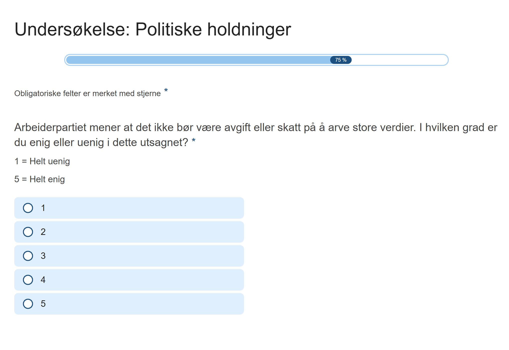
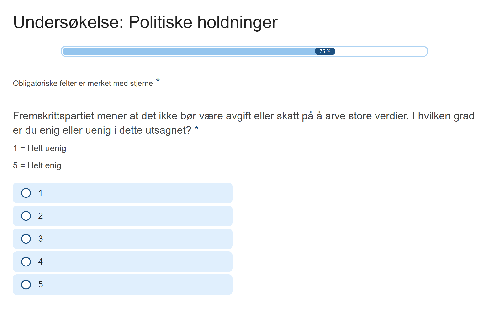

# Introduction

(A/B test)

This section documents the experimental design and the composition of the survey sample. The goal of this study is to examine how party cues influence public opinion - specifically regarding inheritance tax among young people. 

We created two different questionnaires. The respondents were randomly assigned to one of two versions: one where the inheritance tax statement was attributed to The Labour Party (Ap), and another where it was attributed to The Progress Party (Frp). In all other aspects, the two survey versions were identical. 

::: {layout-ncol=2}
{group="treatment" .lightbox style="height: 350px; object-fit: contain;"}

{group="treatment" .lightbox style="height: 350px; object-fit: contain;"}
:::

```{R}
#| include: false 
# Pakker

library(tidyverse)
library(readxl)
library(bst290)
library(texreg)
library(margins)
library(prediction)

# fikse æøå

Sys.setlocale("LC_ALL", "nb_NO.UTF-8")

############## data cleaning ##############
# laste inn

ap <- labelled::unlabelled(read_excel("ap.xlsx"))

frp <- labelled::unlabelled(read_excel("frp.xlsx"))

# endre variabel navn

ap <- ap %>%
  rename(tax = ap_tax)

frp <- frp %>%
  rename(tax = frp_tax)

# legge til identifiserings variabel 

ap$treatment <- "Ap"

frp$treatment  <- "Frp"

# filtrere og sånt

ap <- ap %>%
  select(gender, age, domicil, socmed, polint, tax, party, test, treatment)

frp <- frp %>%
  select(gender, age, domicil, socmed, polint, tax, party, test, treatment)

# fikse test på begge til rett og feil

ap <- ap %>%
  mutate(test_ = recode(test,
                        "Ap" = "Rett",
                        "Frp" = "Feil",
                        "vet_ikke" = "Vet ikke"))

frp <- frp %>%
  mutate(test_ = recode(test,
                        "Frp" = "Rett",
                        "Ap" = "Feil",
                        "vet_ikke" = "Vet ikke"))

# merge

survey <- bind_rows(ap, frp)

# sjekke variabler 

# gender = 1: Kvinne, 2: Mann

survey <- survey %>%
  mutate(gender = na_if(gender, "0")) 

survey <- survey %>%
  mutate(gender = recode(gender, 
                         "1" = "kvinne", 
                         "2" = "mann"))

# age (fjerne alle over 25)

survey$age <- as.numeric(survey$age)

survey <- survey %>%
  mutate(age = ifelse(age <= 25, age, NA))

# domicil 

survey$domicil_num <- as.numeric(survey$domicil)

# socmed 

survey$socmed <- as.numeric(survey$socmed) 

# polint

survey$polint <- as.numeric(survey$polint)

# tax 

survey$tax <- as.numeric(survey$tax)

# party (hvilket parti nærmest)

survey <- survey %>%
  mutate(party = replace(party, party %in% c("annet", "nekt", "vet_ikke"), NA))

```

# Survey Distribution and Descriptive Statistics

## Survey Distribution

To ensure random assignment to the two survey versions, we developed a landing page containing a randomization function that directed respondents to one of the two versions with equal probability. The landing page was made to be responsive, ensuring that it displayed correctly on all devices.

{width=100% .lightbox}

To verify the success of the randomization procedure, we collected background data on gender, age, domicile, social media usage, and political interest. In addition to serving as a balance check, these factors function as explanatory variables in the subsequent analysis. As expected, the answer distribution appears balanced across the two survey versions, suggesting that any observed differences in the dependent variable are likely due to the experimental treatment rather than pre-existing differences between the groups.

Ideally, the number of respondents in each survey version should be approximately equal. As illustrated in the graph below, the final sample consisted of 315 respondents: 143 were assigned to The Progress Party (Frp) version and 172 to The Labour Party (Ap) version. Although the Ap version received 29 more respondents than the Frp version, this difference is within what can be considered normal random variation and does not indicate a failure of the randomization procedure.

```{R}
#| echo: false
#| message: false

survey %>%
  drop_na(treatment) %>%
  ggplot(aes(x = treatment, fill = treatment)) +
  geom_bar(position = "dodge") +
  scale_fill_manual(values = c("Ap" = "#CF111D", "Frp" = "#09367F")) +
  scale_y_continuous(breaks = seq(0,200,20)) +
  labs(x = "", y = "", fill = "Treatment 
Group", title = "Survey Distribution") +
  theme_bw() +
  theme(text = element_text(family = "serif", size = 12))
```

## Respondents Profile

### Gender Distribution

**Question:** *What is your gender?* 

**Options:** *Female, Male, Other/Refusal.*

```{R}
#| echo: false
#| message: false
survey %>%
  drop_na(gender) %>%
  ggplot(aes(x = gender, fill = treatment)) +
  geom_bar(aes(y = after_stat(prop), group = treatment), position = "dodge") +
  scale_fill_manual(values = c("Ap" = "#CF111D", "Frp" = "#09367F")) +
  scale_x_discrete(labels = c("kvinne" = "Female", "mann" = "Male")) +
  scale_y_continuous(labels = scales::percent,
                     breaks = seq(0, 1, by = 0.1)) +
  labs(x = "Gender", y = "", fill = "Treatment 
Group",
       caption = " % of respondents",
       title = "Gender Distribution") +
  theme_bw() +
  theme(text = element_text(family = "serif", size = 12))
```

### Age Distribution

**Question:** *What is your age?* 


A few respondents were over the age of 25. Since our target group is young people, we excluded all respondents above this age. Consequently, only a small number of responses were removed. No one over the age of 25 is included in any analyses or in the graphs visualizing the differences between survey distributions.

```{R}
#| echo: false
#| message: false
survey %>%
  drop_na(age) %>%
  ggplot(aes(x = age, fill = treatment)) +
  geom_bar(aes(y = after_stat(prop), group = treatment), position = "dodge") +
  scale_fill_manual(values = c("Ap" = "#CF111D", "Frp" = "#09367F")) +
  scale_y_continuous(labels = scales::percent,
                     breaks = seq(0, 1, by = 0.05)) +
  scale_x_continuous(breaks = seq(15,25,1)) +
  labs(x = "Age", y = "", fill = "Treatment 
Group",
       caption = "% of respondents",
       title = "Age Distribution") +
  theme_bw() +
  theme(text = element_text(family = "serif", size = 12))
```

### Domicile Distribution

**Question:** *Which of these categories best describes the area where you live?* 

**Options:** *A big city, Suburbs or outskirts of big city, Town or small city, Country village, Farm or home in countryside*

```{R}
#| echo: false
#| message: false
survey %>%
  drop_na(domicil_num) %>%
  ggplot(aes(x = domicil_num, fill = treatment)) +
  geom_bar(aes(y = after_stat(prop), group = treatment), position = "dodge") +
  scale_fill_manual(values = c("Ap" = "#CF111D", "Frp" = "#09367F")) +
  scale_y_continuous(labels = scales::percent,
                     breaks = seq(0, 1, by = 0.1)) +
  scale_x_continuous(
    breaks = 1:5,
    labels = c(
      "A big city",
      "Suburbs or outskirts of big city",
      "Town or small city",
      "Country village",
      "Farm or home in countryside")) +
      labs(x = "", y = "", fill = "Treatment 
Group",
       title = "Domicile Distribution",
       caption = "% of respondents") +
  coord_flip() +
  theme_bw() +
  theme(text = element_text(family = "serif", size = 12)) 
```

### Social Media Usage Distribution

**Question:** *How many hours per day do you spend on social media?* 

**Options:** *0-10 (hours per day)*

```{R}
#| echo: false
#| message: false
survey %>%
  drop_na(socmed) %>%
  ggplot(aes(x = socmed, fill = treatment)) +
  geom_bar(aes(y = after_stat(prop), group = treatment), position = "dodge") +
  scale_fill_manual(values = c("Ap" = "#CF111D", "Frp" = "#09367F")) +
  scale_y_continuous(labels = scales::percent,
                     breaks = seq(0, 1, by = 0.05)) +
  scale_x_continuous(breaks = seq(0,10,1)) +
  labs(x = "Social media use on a typical day (hours)", y = "", fill = "Treatment Group",
       caption = "% of respondents",
       title= "Social Media Use Distribution") +
  theme_bw() +
  theme(text = element_text(family = "serif", size = 12))
```

### Political Interest Distribution

**Question:** *How interested are you in politics?* 

**Options:** *0 = Not interested at all, 5 = Very interested*

```{R}
#| echo: false
#| message: false
survey %>%
  drop_na(polint) %>%
  ggplot(aes(x = polint, fill = treatment)) +
  geom_bar(aes(y = after_stat(prop), group = treatment), position = "dodge") +
  scale_fill_manual(values = c("Ap" = "#CF111D", "Frp" = "#09367F")) +
  scale_y_continuous(labels = scales::percent,
                     breaks = seq(0, 1, by = 0.05)) +
  scale_x_continuous(breaks = seq(0,5,1)) +
  labs(x = "Level of interest in politics", y = "", fill = "Treatment 
Group",
       caption = "% of respondents",
       title = "Political Interest Distribution") +
  theme_bw() +
  theme(text = element_text(family = "serif", size = 12))
```

## Experimental Treatment and Post-Treatment Questions

### Inheritance Tax Support Distribution

**Question:** *\[The Labour Party / The Progress Party\] believes that there should be no tax on inheriting large assets. To what extent do you agree or disagree with this statement?* 

**Options:** *0 = Strongly disagree, 5 = Strongly agree*


As shown in the figure below, there is noticeable variation between the two survey versions. This is particularly evident in the distribution of responses at *2* and *4*, where the frequencies differ substantially between the two groups. This pattern is consistent with the expectation that respondents’ attitudes are influenced by the party associated with the policy proposal.

```{R}
#| echo: false
#| message: false
survey %>%
  drop_na(tax) %>%
  ggplot(aes(x = tax, fill = treatment)) +
  geom_bar(aes(y = after_stat(prop), group = treatment), position = "dodge") +
  scale_fill_manual(values = c("Ap" = "#CF111D", "Frp" = "#09367F")) +
  scale_y_continuous(labels = scales::percent,
                     breaks = seq(0, 1, by = 0.05)) +
  labs(x = "Support for inheritance tax", y = "", fill = "Treatment 
Group",
       caption = "% of respondents",
       title = "Inheritance Tax Distribution Across Survey Versions") +
  theme_bw() +
  theme(text = element_text(family = "serif", size = 12))

```

### Party Affiliation Distribution

**Question:** *Which political party do you feel closest to?* 

**Options:** *Rødt (R), Sosialistisk Venstreparti (SV), Arbeiderpartiet (Ap), Venstre (V), Kristelig Folkeparti (Krf), Senterpartiet (Sp), Høyre (H), Fremskrittspartiet (Frp), Miljøpartiet De Grønne (MDG), Other, Refusal, Don't know*


This question was asked after the treatment, which may explain why more respondents chose The Labour Party (Ap) following the Ap treatment than following the Frp treatment, as the party was still fresh in their memory. The order of the answer options for this question was randomized, preventing one party from receiving more selections simply because it appeared first.

```{R}
#| echo: false
#| message: false
survey %>%
  drop_na(party) %>%
  mutate(party = factor(party, levels = c("R", "SV", "Ap", "Sp", "MDG", "Krf", "V", "H", "Frp"))) %>%
  ggplot(aes(x = party, fill = treatment)) +
  geom_bar(aes(y = after_stat(prop), group = treatment), position = "dodge") +
  scale_fill_manual(values = c("Ap" = "#CF111D", "Frp" = "#09367F")) +
  scale_y_continuous(labels = scales::percent,
                     breaks = seq(0, 1, by = 0.05)) +
  labs(x = "Party affiliation", y = "", fill = "Treatment 
Group",
       caption = "% of respondents",
       title = "Party Affiliation Distribution") +
  theme_bw() +
  theme(text = element_text(family = "serif", size = 12))
```

### Manipulation Check

**Question:** *Which party made the statement you just read about inheritance tax?* 

**Options:** *The Labour Party (Ap), The Progress Party (Frp), Don't know*


Here, the responses have been recoded as either correct or incorrect. As shown in the figure, a larger share of respondents answered incorrectly in the Ap survey version, identifying The Progress Party (Frp) as the source of the statement when it was in fact made by The Labour Party (Ap). This is not surprising, as Frp is more strongly associated with opposition to taxation than Ap. 

This figure also shows that, out of the total 315 respondents, 84 either answered incorrectly or selected *Don't know*.

```{R}
#| echo: false
#| message: false

survey %>%
  drop_na(test_) %>%
  ggplot(aes(x = test_, fill = treatment)) +
  geom_bar(aes(y = after_stat(prop), group = treatment), position = "dodge") +
  scale_x_discrete(labels = c("Vet ikke" = "Don't know", 
                              "Feil" = "Wrong", 
                              "Rett" = "Correct")) +
  scale_fill_manual(values = c("Ap" = "#CF111D", "Frp" = "#09367F")) +
  scale_y_continuous(labels = scales::percent,
                     breaks = seq(0, 1, by = 0.1)) +
  labs(x = "Which party was behind the statement?", y = "", fill = "Treatment 
Group",
       caption = "% of respondents",
       title = "Manipulation Check") +
  theme_bw() +
  theme(text = element_text(family = "serif", size = 12))

```


